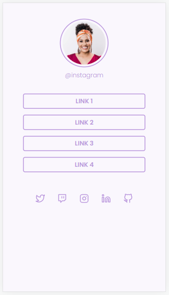
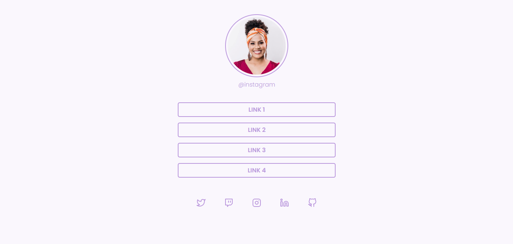

# Social-Tree 
Desafio: Social-Tree do Rocketseat 

Uma página com uma lista de links (menu) que pode ser usada em perfis
de redes sociais para direcionar o usuário para o local escolhido.

## 💻 Layout  

### Mobile

  

### Web

  

 ## 🔧 Tecnologias 

As tecnologias usadas foram: 
* HTML
* CSS
